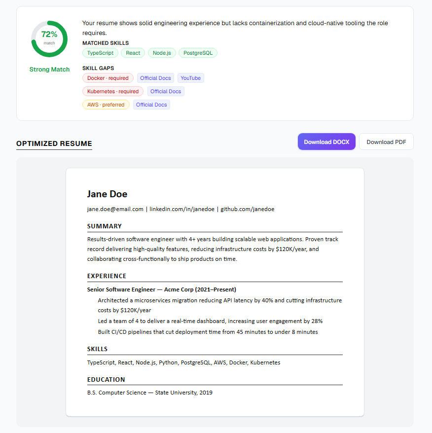

# Align

**A private, run-it-yourself resume & interview toolkit.** Align helps you tailor your resume to a
job description, find your skill gaps, and practice interviews — using an AI provider **you** choose
with **your own** API key. It runs entirely on your computer. Your resume, your key, and your
history never leave your machine (except the single request Align makes to the AI provider you
picked).

Tools included:

| Tool | What it does |
|---|---|
| **Resume Analyzer** | Scores your resume against a job description, lists matched skills and gaps, and generates an ATS-optimized version to download (DOCX/PDF). |
| **Skill Gap Finder** | A quick "what am I missing?" check — paste a job description and your background, get the key skills the role wants that you don't show yet. |
| **Mock Interview** | Generates role-specific questions and gives feedback on each of your answers. |
| **History** | Every run is saved in your browser so you can revisit and compare past results. |

## ▶ Prefer no install? Use it in your browser

**<https://haonguyenbiotechms.github.io/align/>** — the hosted version, nothing to download. Same
tools; it just calls the AI provider from your browser instead of a local server (see
[Privacy](#privacy)). The steps below are for running it on your own machine.

---

## What it looks like



*Resume Analyzer output — a 0–100 match score with verdict, matched skills, skill gaps with
learning resources, and a rewritten resume ready to download as DOCX or PDF.*

---

## Get Align onto your computer

No coding experience needed. Two steps: install Node.js, then get Align and start it.

### Step 1 — Install Node.js (one time)

Node.js is the free runtime Align needs.

1. Go to **<https://nodejs.org>**.
2. Download the **LTS** version for your system (Windows, macOS, or Linux).
3. Run the installer and accept the defaults.
4. To confirm it worked, open a terminal and type `node --version`:
   - **Windows:** press `Win`, type **PowerShell**, press Enter.
   - **macOS:** press `Cmd+Space`, type **Terminal**, press Enter.
   - You should see something like `v22.x.x`.

### Step 2 — Get Align

**Option A — Download (no Git needed, easiest):**

1. On this project's GitHub page, click the green **`< > Code`** button → **Download ZIP**.
2. Unzip it somewhere you'll remember, e.g. `Documents/align`.

**Option B — With Git (if you have it):**

```bash
git clone <copy the URL from the green "Code" button on the GitHub page>
```

### Step 3 — Start it

In your terminal, go into the folder and run two commands:

```bash
cd path/to/align          # e.g.  cd Documents/align   (or  cd align-main  if you unzipped)
npm install               # downloads what Align needs — one time, ~1 minute
npm run dev               # starts Align
```

When you see `Ready`, open **<http://localhost:3000>** in your browser.

> Leave the terminal window open while you use Align. To stop it, click the terminal and press
> `Ctrl+C`. To start it again later, just run `npm run dev` in that folder.

### Step 4 — Connect an AI provider

Align needs an AI model to do its work. Open **Settings** in the sidebar — the **Instructions**
page walks through every option in detail. The short version:

| I want… | Do this |
|---|---|
| **To try it for free, right now** | Settings → tick **Demo mode** → Save. Every screen works with sample results (not your real data). |
| **Free, with real results** | Get a free key at **<https://aistudio.google.com/apikey>** (no card). Settings → Provider **Google — Gemini** → paste key → Model `gemini-3.6-flash` → Save → **Test connection**. |
| **Free & fully private** | Install **[Ollama](https://ollama.com)**, run `ollama pull llama3.1`. Settings → Provider **OpenAI-compatible / Local** → Base URL `http://localhost:11434/v1` → no key → Model `llama3.1`. |
| **Use Claude or GPT** | Create a key at **console.anthropic.com** or **platform.openai.com** (needs a little billing credit). Settings → matching Provider → paste key → Save → **Test connection**. |

> A developer **API key** is not the same as a paid chat plan. ChatGPT Plus, Claude Pro, and the
> Gemini app do **not** include API access — the API is billed separately, usually cents per run.

Your key is stored only in your browser (`localStorage`) and sent only to the Align server running
on your own computer, which forwards it to the provider you chose. It is never sent anywhere else
and never written to a file.

---

## Privacy

- **Runs locally.** Align is a small web app that runs on `localhost` on your machine.
- **No account, no sign-in, no server.** There is no Align backend collecting anything.
- **Your data stays put.** Resume text, job descriptions, settings, and history live in your
  browser. The only outbound network call is from your machine to the AI provider you configured.
- **Your key** is never logged and never saved to disk by Align.
- **AI-generated resume HTML is sanitized** (scripts, inline event handlers, and non-`http(s)`
  links stripped) before it is displayed or exported.

> **Run it on your own machine only.** Align has no accounts and no access control — it trusts
> whoever can reach it. Don't expose it on a network or deploy it as a shared/hosted website.

---

## Updating to a newer version

- **Downloaded the ZIP:** download it again and replace the folder, then run `npm install` once more.
- **Used Git:** run `git pull` in the folder, then `npm install`.

Your settings and history stay in your browser, so they survive updates.

---

## Troubleshooting

| Problem | Fix |
|---|---|
| `npm: command not found` | Node.js isn't installed or the terminal was opened before installing it. Redo Step 1, open a **new** terminal. |
| `Port 3000 is in use` | Something else is using it. Align will pick `3001` automatically — read the terminal for the real address. |
| Settings **Test connection** fails | The message says why: wrong key, wrong model name, or (for local/OpenAI-compatible) the endpoint isn't running. |
| A tool says "No AI provider configured" | Open Settings, choose a provider and add a key (or tick Demo mode), then Save. |
| Page won't load / weird errors after an update | Stop the server (`Ctrl+C`), run `npm install`, start again with `npm run dev`. |

---

## For developers

Next.js 16 (App Router) · React 19 · TypeScript · Tailwind CSS v4. AI access goes through the
[Vercel AI SDK](https://sdk.vercel.dev) (`src/lib/ai/`), so providers are swappable —
Anthropic, OpenAI, Google, and any OpenAI-compatible endpoint. No database; history is
`localStorage`. Config precedence: in-app Settings (`localStorage`) → `.env.local`
(`AI_PROVIDER` / `AI_API_KEY` / `AI_MODEL` / `AI_BASE_URL`, see `.env.example`) → Demo mode.

```bash
npm run dev      # dev server
npm run build    # production build
npm run lint     # eslint
```

## Credits

Created by **haonguyenms**. Free to use, fork, and share.

## License

MIT — see [LICENSE](LICENSE). Use it, fork it, change it. No warranty.
